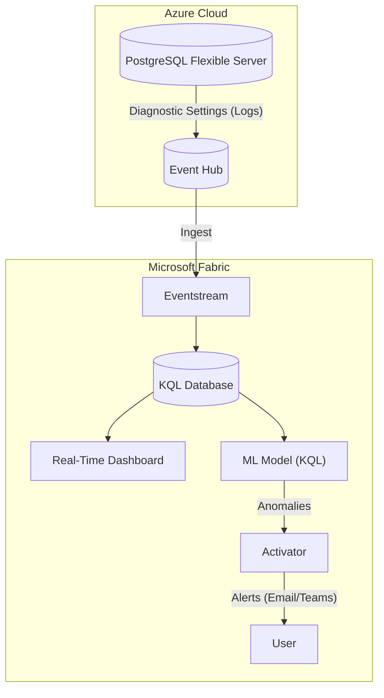

# 🎯 PostgreSQL Anomaly Detection with Microsoft Fabric

Real-time security monitoring and advanced anomaly detection for Azure PostgreSQL Flexible Server using Microsoft Fabric Real-Time Intelligence.

---

## 🏗️ Architecture



## 🚨 Capabilities

### 1. Basic Security (SIEM-like)
| Anomaly | Threshold | Severity |
|---|---|---|
| **Data Exfiltration** | >15 SELECTs / 5min | 🔴 Critical |
| **Destructive Ops** | >5 DROP/DELETE / 2min | 🟠 High |
| **Error Spikes** | >15 errors / 1min | 🔴 Critical |

### 2. Advanced Detection (v3)
| Anomaly | Why Defender Fails | Fabric Solution |
|---|---|---|
| **Privilege Escalation** | Individual GRANTs look normal | Tracks **sequence** of privilege ops |
| **Cross-Schema Recon** | Ignores lateral movement | Tracks distinct schema access count |
| **Deep Schema Enum** | Ignores meta-data queries | Detects scans of `pg_catalog` |
| **Behavioral ML** | No user baseline | `series_decompose_anomalies()` on user history |

---

## 🚀 Deployment Guide

### Phase 1: Azure PostgreSQL Setup
1.  **Enable pgaudit**:
    *   Server Parameters -> `shared_preload_libraries` -> add `pgaudit`.
    *   `pgaudit.log` = `write, ddl, role` (recommended).
    *   **Restart Server**.
2.  **Configure Logging**:
    *   `log_checkpoints` = `on`
    *   `log_connections` = `on` (Crucial for user mapping)
    *   `log_disconnections` = `on`
    *   `log_line_prefix` = `%t [%p]: user=%u,db=%d,app=%a,client=%h `
3.  **Diagnostic Settings**:
    *   Send `PostgreSQLLogs` to an **Event Hub**.

### Phase 2: Fabric Infrastructure
You can use the automated script or create resources manually.

**Option A: Automated Script**
```bash
./scripts/deploy-fabric.sh <workspace_name>
```

**Option B: Manual Setup**
1.  Create an **Eventhouse** (e.g., `PostgreSQLMonitor`).
2.  Create a **KQL Database** (e.g., `SecurityLogs`).
3.  Execute `queries/ANOMALY-DETECTION-SETUP.kql` to create metrics tables and update policies.

### Phase 3: Data Ingestion
1.  Create a **Fabric Eventstream**.
2.  **Source**: Azure Event Hub (connect to the one from Phase 1).
3.  **Destination**: KQL Database -> Table `bronze_pssql_alllogs_nometrics`.
4.  **Format**: JSON.

### Phase 4: Detection Logic
1.  Open your KQL Database queryset.
2.  Copy content from `queries/UNIFIED-ANOMALY-DETECTION.kql`.
3.  Run the queries to validate data is flowing and anomalies are detected.

### Phase 5: Alerting (Activator)
Configure **Fabric Activator** rules based on the documentation:
👉 [**Read Alert Rules Guide**](docs/ACTIVATOR-ALERT-RULES.md)

---

## 📁 Project Structure

```
├── README.md                           # This file
├── TEST-ANOMALY-TRIGGERS.sql           # SQL script to generate test anomalies
│
├── scripts/                            # Automation scripts
│   ├── deploy-fabric.ps1               # Windows deployment
│   └── deploy-fabric.sh                # Linux/Mac deployment
│
├── queries/                            # KQL Logic
│   ├── UNIFIED-ANOMALY-DETECTION.kql   # Core logic for dashboards & alerts
│   └── ANOMALY-DETECTION-SETUP.kql     # Setup: Tables, policies, mappings
│
└── docs/                               # Documentation
    ├── ACTIVATOR-ALERT-RULES.md        # 🚨 Alert configuration rules
    ├── DATA-AGENT-INSTRUCTIONS.md      # AI Agent instructions (Copilot)
    ├── DATA-SOURCE-INSTRUCTIONS.md     # KQL Table reference
    └── USEFUL-AGENT-PROMPTS.md         # Prompts for AI analysis
```

## 🔧 Troubleshooting

*   **No Data?**: check if `EventProcessedUtcTime` in KQL is recent. If not, check Event Hub connection.
*   **User="UNKNOWN"?**: `log_connections` is likely OFF in PostgreSQL.
*   **No Audit Logs?**: `pgaudit` extension is not enabled or `pgaudit.log` parameter is empty.

---

**Version**: 3.1
**Last Updated**: Jan 2026
